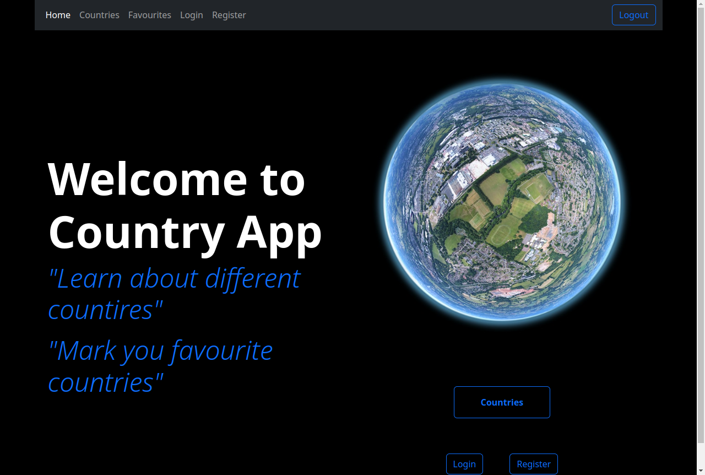

# Country App

## Description

This app displays some key information of all countries in cards. Clicking on each card shows detailed information about that country. Users can see all country cards and detail pages. Moreover, users can mark a country as a favorite and see all their favorite countries in the favorites section. To access the favorite feature, users are needed to be registered and logged in. This project is an assignment of my Advance React course.

## Technologies

- JavaScript
- React
- Bootstrap
- React-router
- React-redux
- Firebase authentication
- Firebase database

## Author

Bishwajit Das

## Acknowledgement

I would like to acknowledge <a href="https://github.com/martin-holland#martin-holland">Martin Holland</a> for his valuable lessons and insights during my project. He always motivates and makes the app better.

### Live Site

https://country-app-82928.web.app/countries
